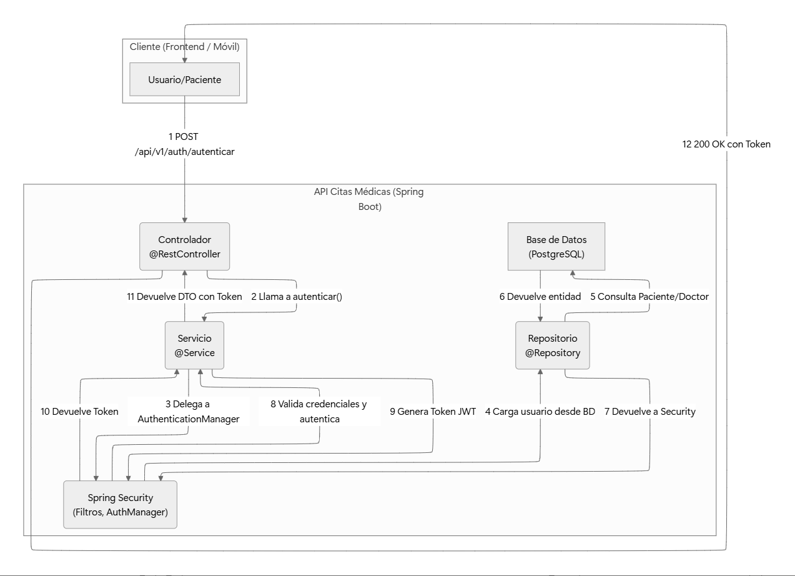
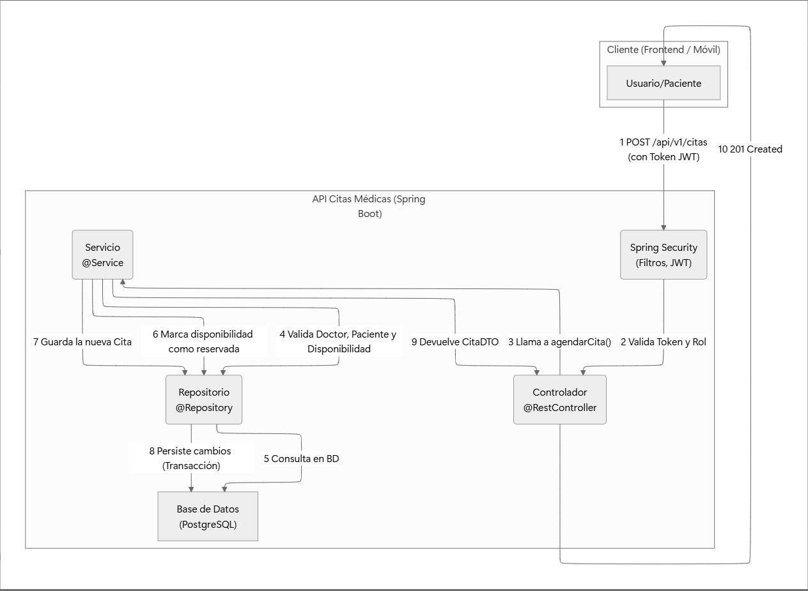

# **API REST de Gestión de Citas Médicas**

Una API RESTful  construida con Spring Boot para gestionar un sistema completo de citas médicas.

## **✨ Características Principales**

- **API RESTful Completa:** Endpoints para la gestión integral de Doctores, Pacientes, Especialidades, Disponibilidades y Citas.
- **Seguridad Basada en JWT:** Autenticación y autorización utilizando JSON Web Tokens (JWT) para una comunicación segura y sin estado.
- **Autorización a Nivel de Método:** Control de acceso granular utilizando Spring Security y anotaciones `@PreAuthorize` para proteger la lógica de negocio crítica.
- **Arquitectura Limpia y Desacoplada:** Sigue una arquitectura en capas (controlador, servicio, repositorio, mapeador) que promueve la alta cohesión, el bajo acoplamiento y la mantenibilidad.
- **Persistencia con JPA/Hibernate:** Utiliza Spring Data JPA para una interacción eficiente y estandarizada con bases de datos relacionales.
- **Lógica de Negocio Transaccional:** Gestiona operaciones complejas como el agendamiento y la cancelación de citas con atomicidad (`@Transactional`), previniendo condiciones de carrera e inconsistencias.
- **Mapeo de Objetos Eficiente:** Utiliza MapStruct para la conversión de alto rendimiento y sin código repetitivo entre entidades JPA y DTOs.

## **🏛️ Arquitectura del Sistema**

El siguiente diagrama ilustra dos de los flujos más importantes de la aplicación: el registro y autenticación de un nuevo paciente, y el proceso de agendamiento de una cita.
### **Flujo de Autenticación de Usuario**



### **Flujo de Agenda de Cita**




### Flujo completo de la aplicacion


## **🛠️ Tecnologías Utilizadas**

- **Lenguaje:** Java 17+
- **Framework Principal:** Spring Boot 3
- **Persistencia:** Spring Data JPA, Hibernate
- **Seguridad:** Spring Security, JWT (jjwt)
- **Base de Datos:** PostgreSQL (producción), H2 (pruebas)
- **Gestión de Dependencias:** Maven
- **Utilidades:** Lombok, MapStruct
- **Pruebas:** JUnit 5, Mockito

## **🚀 Cómo Empezar**

Sigue estos pasos para tener una copia del proyecto funcionando en tu máquina local.

### **Prerrequisitos**

- JDK 17 o superior.
- Apache Maven 3.6+
- Una instancia de PostgreSQL corriendo. Docker es una excelente opción para esto:

    ```bash
    docker run -d -p 5432:5432 --name citas-postgres -e POSTGRES_PASSWORD=password -e POSTGRES_USER=user -e POSTGRES_DB=citas_db postgres
    
    ```


### **Instalación**

1. **Clona el repositorio:**

    ```bash
    git clone <URL_DE_TU_REPOSITORIO>
    
    ```

2. **Navega al directorio del proyecto:**

    ```bash
    cd citasmedicas
    
    ```


## **⚙️ Configuración de Entorno**

El proyecto se configura a través del archivo `src/main/resources/application.properties`.

Las configuraciones principales que debes verificar son la conexión a la base de datos y los secretos de JWT:

```
# Configuración de la Base de Datos (PostgreSQL)
spring.datasource.url=jdbc:postgresql://localhost:5432/citas_db
spring.datasource.username=user
spring.datasource.password=password
spring.jpa.hibernate.ddl-auto=update

# Configuración de Seguridad JWT
jwt.secret.key=tu_super_secreto_largo_y_seguro_aqui_de_al_menos_256_bits
jwt.expiration.ms=86400000 # 24 horas

```

Asegúrate de que la configuración de la base de datos coincida con tu instancia de PostgreSQL y **cambia el `jwt.secret.key` por un valor seguro y único.**

## **🏃 Ejecución de la Aplicación**

- **Para ejecutar la aplicación en modo de desarrollo:**

    ```bash
    mvn spring-boot:run
    
    ```

  La API estará disponible en `http://localhost:8080`.

- **Para construir el archivo JAR para producción:**

    ```bash
    mvn clean package
    
    ```

  Luego puedes ejecutar el JAR con:

    ```bash
    java -jar target/citasmedicas-0.0.1-SNAPSHOT.jar
    
    ```


## **🧪 Ejecución de las Pruebas**

Para ejecutar la suite completa de pruebas unitarias y de integración, utiliza el siguiente comando:

```bash
mvn test

```

## **📖 Documentación de la API**

La base de la API se encuentra en `/api/v1`.

### Endpoints de Autenticación (`/auth`)

| Verbo | Endpoint | Seguridad | Descripción |
| --- | --- | --- | --- |
| `POST` | `/registro/paciente` | `permitAll()` | Registra un nuevo usuario con el rol de Paciente. |
| `POST` | `/autenticar` | `permitAll()` | Inicia sesión y devuelve un token JWT. |

### Endpoints de Doctores (`/doctores`)

| Verbo | Endpoint | Seguridad | Descripción |
| --- | --- | --- | --- |
| `GET` | `/` | `permitAll()` | Obtiene una lista paginada de doctores, opcionalmente filtrada por especialidad. |
| `GET` | `/{id}` | `permitAll()` | Obtiene los detalles de un doctor específico. |
| `PUT` | `/{id}` | `ADMIN` o `DOCTOR` (propietario) | Actualiza la información de un doctor. |
| `GET` | `/{doctorId}/disponibilidades` | `permitAll()` | Obtiene los horarios disponibles de un doctor en un rango de fechas. |
| `POST` | `/{doctorId}/disponibilidades` | `DOCTOR` (propietario) | Un doctor añade un nuevo bloque de disponibilidad. |
| `DELETE` | `/disponibilidades/{disponibilidadId}` | `DOCTOR` (propietario) | Un doctor elimina un bloque de disponibilidad no reservado. |

### Endpoints de Pacientes (`/pacientes`)

| Verbo | Endpoint | Seguridad | Descripción |
| --- | --- | --- | --- |
| `GET` | `/{id}` | `ADMIN` o `PATIENT` (propietario) | Obtiene los detalles de un paciente específico. |
| `PUT` | `/{id}` | `ADMIN` o `PATIENT` (propietario) | Actualiza la información de un paciente. |
| `GET` | `/{patientId}/citas` | `ADMIN` o `PATIENT` (propietario) | Obtiene el historial de citas de un paciente. |

### Endpoints de Citas (`/citas`)

| Verbo | Endpoint | Seguridad | Descripción |
| --- | --- | --- | --- |
| `POST` | `/` | `PATIENT` | Agenda una nueva cita en un horario disponible. |
| `GET` | `/{citaId}` | `ADMIN` o Propietario (Doctor o Paciente) | Obtiene los detalles de una cita específica. |
| `PATCH` | `/{citaId}` | Propietario (Doctor o Paciente) | Cancela una cita. Aplica la política de cancelación de 24 horas. |

---